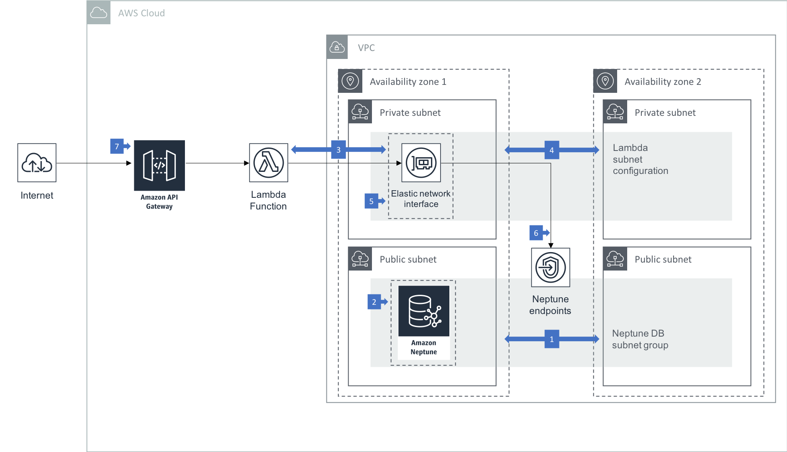

# Accessing Amazon Neptune from AWS Lambda Functions

Amazon Neptune runs inside your private VPC and its endpoints can be accessed only by resources inside the VPC. To expose the endpoints outside the VPC you can use a load balancer - either an Application Load Balancer or a Network Load Balancer.

If you are building an application or service on Amazon Neptune, you may choose to expose an API to your clients, rather than offer direct access to the database. AWS Lambda allows you to build and run application logic without provisioning or managing servers. Amazon API Gateway allows you to publish secure APIs that access code running on AWS Lambda.

This architecture shows you how to connect AWS Lambda functions to Amazon Neptune.

### Walkthrough of the Architecture

  1. In this architecture your Neptune cluster is run in at least two subnets in two Availability Zones, with each subnet in a different Availability Zone. By distributing your cluster instances across at least two Availability Zones, you help ensure that there are instances available in your DB cluster in the unlikely event of an Availability Zone failure.
  2. Neptune's VPC security group is configured to allow access from the AWS Lambda security group on the Neptune cluster's port.
  3. AWS Lambda is [configured to access resources in your VPC](https://docs.aws.amazon.com/lambda/latest/dg/vpc.html). Doing so allows Lambda to create elastic network interfaces (ENIs) that enable your function to connect securely to Neptune. 
  4. The Lambda VPC configuration information includes at least 2 private subnets, allowing Lambda to run in high availability mode.
  5. The VPC security group that Lambda uses is permitted to access Neptune via an inbound rule on the Neptune VPC security group.
  6. Code running in your Lambda function uses a Gremlin or SPARQL client to submit queries to the Neptune cluster's cluster, reader and/or instance endpoints.
  7. API Gateway exposes API operations that accept client requests  and execute your backend Lambda functions.
  
### Best Practices

  * If you require external internet access for your function, configure your Lambda security group to allow outbound connections and route outbound internet traffic via a [NAT gateway attached to your VPC](https://aws.amazon.com/premiumsupport/knowledge-center/internet-access-lambda-function/).
  * Lambda functions that are configured to run inside a VPC incurs an additional ENI start-up penalty. This means address resolution may be delayed when trying to connect to network resources. As an alternative to running inside a VPC, you can run your Lambda functions outside your VPC and connect to the Neptune endpoints via a load balancer. If you do this, you should consider enabling [IAM database authentication](https://docs.aws.amazon.com/neptune/latest/userguide/iam-auth.html) on your Neptune cluster, and configuring the Lambda execution role with an IAM policy that grants access to the database. 
  * If your Lambda functions connect to Neptune using WebSockets, ensure they close their connections at the end of each invocation. While this adds some additional latency opening a connection per function invocation, it avoids your functions exceeding the Neptune WebSocket connection limit of 60,000 connections. Note that some Gremlin clients may pause for a 'quiet period' when closing connections. The [Java client's](http://tinkerpop.apache.org/docs/current/reference/#gremlin-java) `Cluster.close()` method, for example, waits two seconds before returning, which can add an unacceptable latency in a latency sensitive and/or high throughput scenario. Use the `Cluster.clsoeAsync()` method instead.
  * Because a connection pool will last only for the duration of a single Lambda invocation, and will often service only one request, consider reducing the size of the connection pool. Alternatively, if you are using Gremlin, consider submitting requests to the [Gremlin HTTP REST endpoint](https://docs.aws.amazon.com/neptune/latest/userguide/access-graph-gremlin-rest.html) rather than the WebSockets endpoint, thereby avoiding the need to create and manage the lifetime of a connection pool. The downside of this approach is that you must write string-based queries, rather than take advantage of the strongly-typed [Gremlin Language Variants](http://tinkerpop.apache.org/docs/current/reference/#gremlin-variants) (GLV) that allow you to write Gremlin directly in your programming language of choice. 
  
### Learn More

  * Find recommendations for using Amazon Neptune and maximizing performance in [Best Practices: Getting the Most Out of Neptune](https://docs.aws.amazon.com/neptune/latest/userguide/best-practices.html)
  * [Building Serverless Calorie tracker application with AWS AppSync and Amazon Neptune](https://github.com/aws-samples/aws-appsync-calorie-tracker-workshop/) workshop.