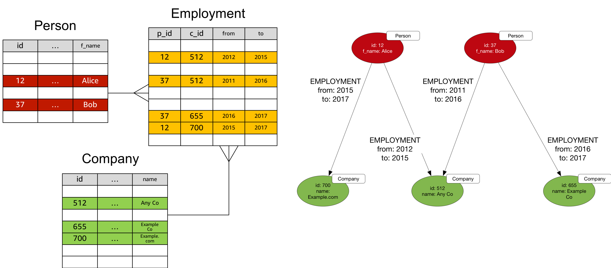
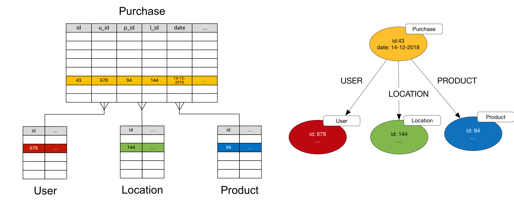
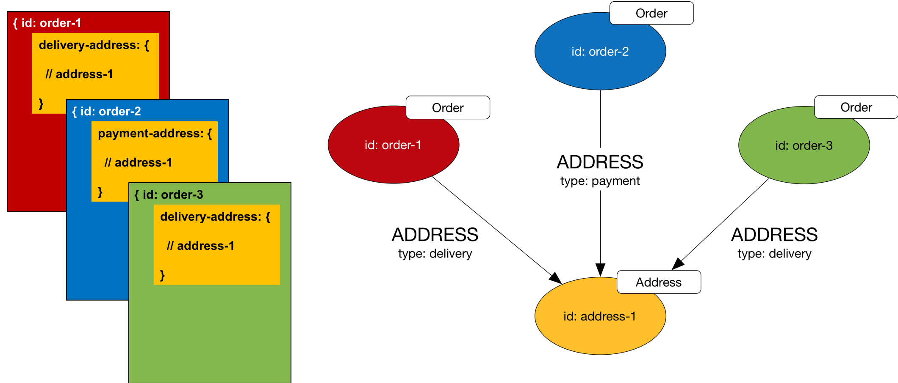

# Converting Other Data Models to a Graph Model

As described in [Overview of the Design Process](../graph-data-modelling#overview-of-the-design-process), when building a graph database application it is best to design an application graph data model and graph queries by working backwards from a set of application use cases, and using the model as a target for any subsequent data ingest from other systems.

However, you may sometimes need to take data from another data technology and ingest it into a graph database prior to undertaking any explicit application-specific graph data modelling. In these circumstances you can apply a number of 'mechanical' transformations that yield a naive graph model. This model will not necessarily be optimised for specific use cases and queries, but it can provide the basis for exploration and the iterative development of an application graph data model.

  * [Converting a Relational Data Model to a Graph Model](#converting-a-relational-data-model-to-a-graph-model)
  * [Converting a Document-Oriented Data Model to a Graph Model](#converting-a-document-oriented-data-model-to-a-graph-model)
  * [Converting a Key-Value Data Model to a Graph Model](#converting-a-key-value-data-model-to-a-graph-model)

## Converting a Relational Data Model to a Graph Model

### Tables

As a rule of thumb, each row in a table can be converted to a vertex in a property graph, or a set of statements with a common subject in an RDF graph. 


When converting to a property graph:

  * Convert the column names to property keys.
  * Use the table name as the label for each vertex. 
  * Concatenate primary key values to generate each vertex ID.

```
g.addV('Person').property(id, '12').property('f_name', 'Alice')
```

When converting to an RDF graph:

  * Column names and values become predicates and object literals.
  * The table name becomes an object literal value of an rdf:type predicate. 
  * Concatenate primary key values to generate each resource ID.

```
PREFIX s: <http://www.example.com/social#>
PREFIX rdf: <http://www.w3.org/1999/02/22-rdf-syntax-ns#>

INSERT
{
    s:12 rdf:type s:Person ;
     s:firstName "Alice" .
}
WHERE {}
```

### Foreign Keys

Foreign key relations can be modelled as edges. 


When converting to a property graph:

  * Choose an edge direction and label that best express the domain semantics of the relationship.
  * Concatenate primary and foreign key values to generate the edge ID.

In Gremlin, assuming the Person and Address vertices already exist:

```
g.V('12').addE('ADDRESS').to(V('512')).property(id, '512-12')
```

When converting to an RDF Graph:

  * Represent the relationship using a triple whose subject and object are URIs identifying the resources to be connected.
  * Choose a direction and predicate value that best express the domain semantics of the relationship.

```
PREFIX s: <http://www.example.com/social#>
PREFIX rdf: <http://www.w3.org/1999/02/22-rdf-syntax-ns#>

INSERT
{
    s:12 s:address s:512 .
}
WHERE {}
```

### Join Tables With Two Foreign Keys

Each row in a join table with two foreign keys can be converted to an edge with edge properties.



When converting to a property graph:

  * Use the join table name for the edge label.
  * Concatenate foreign keys to create the edge ID.
  * Convert the remaining columns to edge properties.

In Gremlin, assuming the Person and Company vertices already exist:

```
g.V('12').addE('EMPLOYMENT').to(V('512')).
  property(id, '12-512').
  property('from', 2012).
  property('to', 2015)
```

When converting to an RDF graph you will have to introduce an intermediate node:

  * Use the join table name to type the node.
  * Concatenate foreign keys to create the subject URI.

```
PREFIX j: <http://www.example.com/jobs#>
PREFIX rdf: <http://www.w3.org/1999/02/22-rdf-syntax-ns#>

INSERT
{
    j:512-12 rdf:type j:Employment ;
      j:from 2012 ;
      j:to 2015 ;
      j:company j:512 ;
      j:person j:12 .
}
WHERE {}
```

### Tables With More Than Two Foreign Keys

If a table contains more than two foreign keys, convert each row to an intermediate node, and convert the foreign keys into edges connecting the intermediate node to other nodes. 



In Gremlin, assuming the User, Location and Product vertices already exist:

```
g.addV('Purchase').property(id, '43').property('date', '14-12-2018').
  V('43').addE('USER').to(V('678')).property(id, '43-678').
  V('43').addE('LOCATION').to(V('144')).property(id, '43-144').
  V('43').addE('PRODUCT').to(V('94')).property(id, '43-94')
```

In SPARQL:

```
PREFIX o: <http://www.example.com/orders#>
PREFIX rdf: <http://www.w3.org/1999/02/22-rdf-syntax-ns#>

INSERT
{
    o:43 rdf:type o:Purchase ;
      o:date "14-12-2018" ;
      o:user c:678 ;
      o:location c:144 ;
      o:product c:94 .
}
WHERE {}
```

## Converting a Document-Oriented Data Model to a Graph Model

Document-oriented databases store semi- or variably-structured documents, usually encoded as JSON or XML. 

Nested Structures

Documents often comprise a nested structure containing all the information necessary to satisfy a business operation. Such self-contained islands of information are sometimes called [aggregates](https://martinfowler.com/bliki/DDD_Aggregate.html). An order document, for example, may contain multiple line items together with the billing and delivery addresses necessary to satisfy payment and fulfilment processes. 

Document-oriented data models favour redundancy over explicit joins. Continuing the order example, if a customer places several orders, each order document will contain its own billing and delivery addresses so that it can be processed as a single unit without having to execute joins in the application layer.

To convert a nested structure to a graph model, extract the nested items and create a node for each unique nested item (thereby removing any data redundancy). Create a node for each parent document and connect this node to the node representing the nested item. Derive an edge label (and, if necessary a qualifying property) from the property key used to identify the nested item in the parent document. 



In Gremlin, create the Orders and Address like this:

```
g.V().addV('Order').property(id, 'order-1').
  addV('Order').property(id, 'order-2').
  addV('Order').property(id, 'order-3').
  addV('Address').property(id, 'address-1').
  V('order-1').addE('ADDRESS').to(V('address-1')).
    property(id, 'order-1-address-1').property('type', 'delivery').
  V('order-2').addE('ADDRESS').to(V('address-1')).
    property(id, 'order-2-address-1').property('type', 'payment').
  V('order-3').addE('ADDRESS').to(V('address-1')).
    property(id, 'order-3-address-1').property('type', 'delivery')
```

In SPARQL we use intermediate nodes to hold the address type property:

```
PREFIX o: <http://www.example.com/orders#>
PREFIX rdf: <http://www.w3.org/1999/02/22-rdf-syntax-ns#>

INSERT
{
    o:order-1 rdf:type o:Order .
    o:order-2 rdf:type o:Order .
    o:order-3 rdf:type o:Order .
    o:address-1 rdf:type o:Address .
    o:order-1-address-1 o:type "delivery" ;
      o:order o:order-1 ;
      o:address o:address-1 .
    o:order-2-address-1 o:type "payment" ;
      o:order o:order-2 ;
      o:address o:address-1 .
    o:order-3-address-1 o:type "delivery" .
      o:order o:order-3 ;
      o:address o:address-1 .
}
WHERE {}
```

### Document Joins

Some document-oriented application models join documents across collections by including the IDs of external documents in a field in the document to which they are to be joined. Treat these scenarios as you would foreign keys in a relational schema.

## Converting a Key-Value Data Model to a Graph Model

TODO


