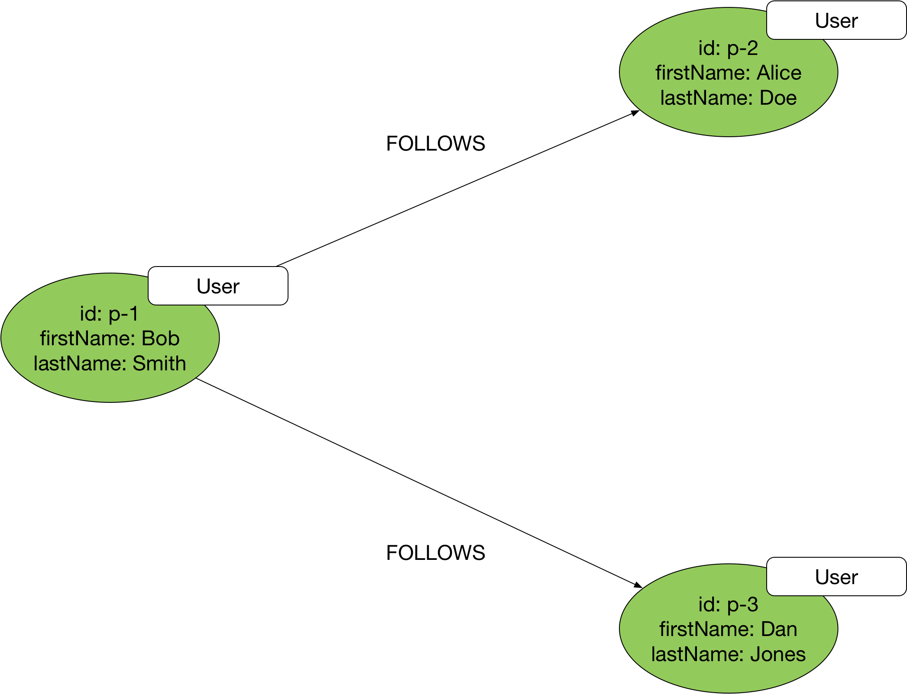
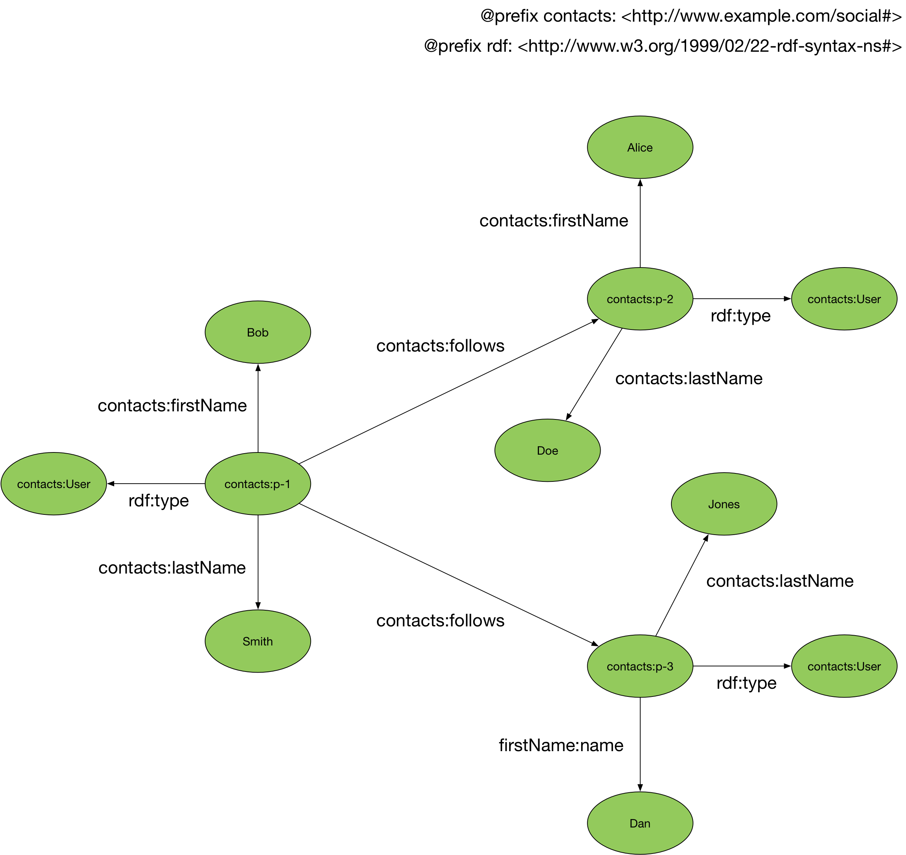

# Data Models and Query Languages

A graph data model connects items or values using elements variously called edges, links or relationships. Many application domains can be modelled as graphs: social, follower and business relationship networks, IT and physical network infrastructures, organizatonal structures, entitlements and access control networks, logistics and delivery networks, supply chains, etc.

Neptune supports two different graph data models: the [property graph](https://en.wikipedia.org/wiki/Graph_database#Labeled-Property_Graph) data model, and the [Resource Description Framework](https://www.w3.org/RDF/). Each data model has its own query language for creating and querying graph data. For a property graph, you create and query data using [Apache Tinkerpop Gremlin](http://tinkerpop.apache.org/docs/current/reference/), an open source query language supported by several other graph databases. For an RDF graph you create and query data using [SPARQL](https://www.w3.org/TR/rdf-sparql-query/), a graph pattern matching language standardized by the W3C.

## Property Graph and Gremlin

### Vertices and Edges

The property graph data model represents graph data as _vertices_ and _edges_ (sometimes called nodes and relationships). You typically use vertices to represent entities in your domain, edges to represent the relationships between these entities. Every edge must have a name, or label, and a direction – that is, a start vertex and an end vertex. Neptune's property graph model doesn't allow dangling edges.

### Properties

You can attach one or more _properties_ to each of the vertices and edges in your graph. Typically, you use vertex properties to represent the attributes of entities in your domain, and edge properties to represent the strength, weight or quality of a relationship. You can also use properties to represent metadata – timestamps, access control lists, etc.

### IDs

Every vertex and every edge in the graph must have a unique ID. Because every edge has its own identity, you can create multiple edges connecting the same pair of vertices.

> Some graph databases allow you to assign your own IDs to vertices and edges. Others automatically create IDs for you. Neptune allows you to supply your own IDs when creating vertices and edges: if you don't assign your own ID to an element, Neptune will create a string-based UUID for you. All vertex IDs must be unique, and all edge IDs must be unique. However, Neptune does allow a vertex and an edge to have the same ID. 

### Labels

As well as adding properties to the elements in your graph, you can also attach labels to both the vertices and edges. Edge labels are mandatory: you must attach exactly one label to each edge in your graph. An edge's label expresses the semantics of the relationship represented by the edge. Vertex labels are optional: you can attach zero, one or many labels to each vertex in your graph. Vertex labels allow you to tag, type and group vertices. 

### Example

In the following diagram we see three vertices. Each vertex is labelled `User`, and has an `id`, and `firstName` and `lastName` properties. The vertices are connected by edges labelled `FOLLOWS`.



To query a property graph in Neptune you use the Gremlin query language. The following Gremlin query finds the names of the users whom Bob follows:

```
g.V('p-1').out('FOLLOWS').valueMap('firstName', 'lastName')
```

### Learn More

  * [Apache TinkerPop Documentation](http://tinkerpop.apache.org/docs/current/reference/)
  * [PRACTICAL GREMLIN: An Apache TinkerPop Tutorial](http://kelvinlawrence.net/book/Gremlin-Graph-Guide.html)

## RDF Graph and SPARQL

RDF encodes resource descriptions in the form of subject-predicate-object triples. In contrast to the property graph model, which 'chunks' data into record-like vertices and edges with attached properties, RDF creates a more fine-grained representation of your domain.

The following diagram shows the same information as the property graph above, but this time encoded as RDF.



Subjects and predicates in RDF are always URIs. Object values can be either URIs or literals. In the example shown above, the triple `contacts:p-2 contacts:firstName “Alice”` comprises a URI subject and predicate, and a string literal object. Relationships between resources use URI-based object values.

To query an RDF graph you use SPARQL. The following SPARQL query finds the names of the users whom Bob follows:

```
PREFIX s: <http://www.example.com/social#>

SELECT ?firstName ?lastName WHERE {
    s:p-1 s:follows ?p .
    ?p s:firstName ?firstName .
    ?p s:lastName ?lastName
}
```

## Choosing a Data Model and Query Language for Your Workload

Both graph data models and query languages – property graph and Gremlin, RDF and SPARQL – can be used to implement the majority of graph database workloads. Application developers and those coming from a relational database background often find the property graph model easier to work with, whereas those familiar with Semantic Web technologies may prefer RDF, but there are no hard-and-fast rules. 

In choosing a model and query language, bear in mind the following points:

  * The property graph data model has no schema and no predefined vocabularies for property names and labels. You must create your own application-specific data model and enforce constraints around the naming of labels and properties in your application layer. RDF, on the other hand, has predefined [schema vocabularies](https://www.w3.org/TR/rdf-schema/) with well-understood data modelling semantics for specifying class and property schema elements, and predefined domain-specific vocabularies such as [vCard](https://www.w3.org/TR/vcard-rdf/), [FOAF](http://xmlns.com/foaf/spec/), [Dublin Core](http://dublincore.org/) and [SKOS](https://www.w3.org/2004/02/skos/) for describing resources in different domains: contact information, social network relations, document metadata and knowledge networks, for example. 
  * RDF was designed to make it easy to share and publish data with fixed, well-understood semantics. There exist today many linked and open datasets – for example [DBpedia](https://en.wikipedia.org/wiki/DBpedia) and [GeoNames](https://en.wikipedia.org/wiki/GeoNames) – that you can incorporate into your own application. Insofar as your own data reuses vocabularies shared with any third-party dataset you ingest, data integration occurs as a side-effect of the linking across datasets facilitated by these shared vocabularies.
  * Property graphs support edge properties, making it easy to associate edge attributes, such as the strength, weight or quality of a relationship or some edge metadata, with the edge definition. To qualify an edge in RDF with additional data, you must use intermediate nodes or blank nodes – nameless nodes with no permanent identity – to group the edge values. Intermediate nodes can complicate an RDF model and the associated queries. If your workload requires applying computations over edge attributes in the course of a graph traversal, consider using a property graph and Gremlin.
  * RDF supports the concept of named graphs, allowing you to group a set of RDF statements and identify them with a URI. Named graphs allow you to distinguish logical or domain-specific subgraphs within your dataset, and attach additional statements that apply to these subgraphs as a whole. The property graph data model allows you to create multiple disconnected subgraphs within the same dataset, but has no equivalent to named graphs that allows you to identify and address individual subgraphs. If you need to differentiate between and manage multiple subgraphs in your dataset – for example, on behalf of multiple tenants – consider using RDF.
  * Gremlin, being an imperative traversal language, allows for an algorithmic approach to developing graph queries. It supports iterative looping constructs (e.g. `repeat().until()`) and path extraction, making it easy to traverse variable-length paths and extract and apply computations over property values in the paths traversed. SPARQL makes it easy to find instances of known graph patterns, even those with optional elements, and to extract values from the pattern instances that have been found.
  * While every edge in a property graph or RDF graph must be directed, Gremlin allows you to ignore edge direction in your queries (using `both()` and `bothE()` steps). If you need to model bi-directional relationships, consider using a property graph with Gremlin. Alternatively, if you use RDF, you will have to introduce pairs of relationships between resources.


