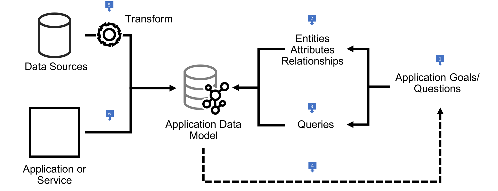
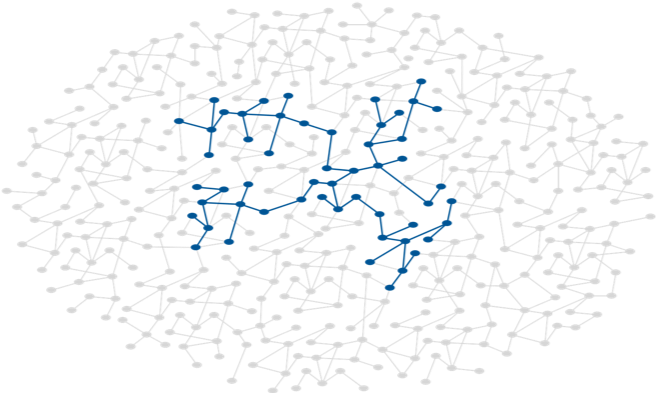
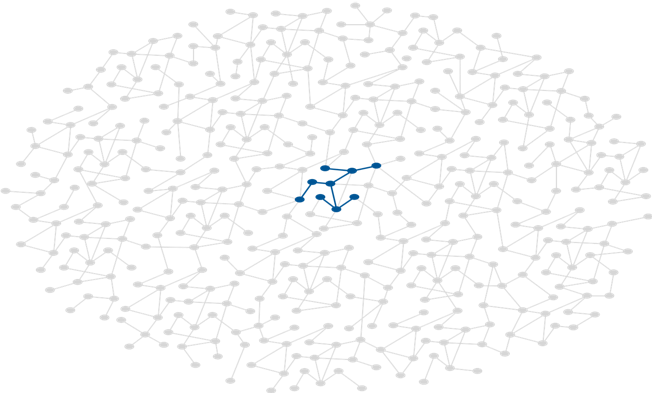
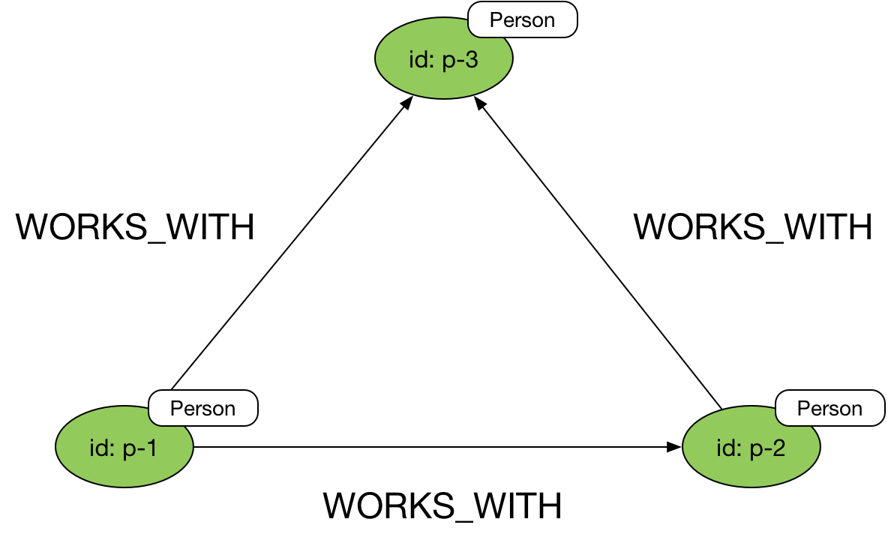

# Graph Data Modelling

When you build a graph database application you will have to design and implement an application graph data model, together with graph queries that address that model. The application graph data model should express the application domain; the queries should answer the questions you would have to pose to that domain in order to satisfy your application use cases.

You build the application graph data model from graph primitives – vertices, edges, labels and properties in the case of a property graph, subject-predicate-object triples for RDF. You name these primitives to express the semantics of the application domain. You structure them to facilitate the path traversals or graph patterns contained in your queries.

Think of your application graph model and your queries as being two sides of the same coin. The graph is the superset of paths or graph patterns expressed in your queries. In order to achieve this degree of alignment between model and queries, employ a 'design for queryability' approach, whereby you drive out the model and the queries on a use-case-by-use-case basis.

## Overview of the Design Process



  1. Work backwards from your application or end-user goals. These goals are typically expressed as a backlog of feature requests, use cases or agile user stories. For each use case write down the questions you would have to put to the domain in order to facilitate the outcomes that motivate the use case. What would you need to know, find, or compute?
  2. Review these questions and identify candidate entities, attributes and relationships. These become the basis of your graph model, implemented using the primitives particular to either the property graph or RDF.
  3. Review these questions and your prototype application graph model to determine how you would answer each question by traversing paths through the graph or matching structural patterns in the graph. Adjust the model until you are satisfied it faciliatates querying in an efficient and expressive manner.
  4. Continue to iterate over your use cases, refining your candidate model and queries as you introduce new features.
  5. Once you have a candidate application graph data model you can treat this as a target for any necessary data migration and integration scenarios. Identify existing sources of data and implement extract, transform and load (ETL) processes that ingest data into the target model.
  6. If you are building an application or service on top of a graph database, design and implement write operations that  insert, modify and if necessary delete data in the target application graph model.
  
### Best Practices

  * Develop your model and queries in a test-driven fashion. Create test fixtures that install a sample dataset in a known state, and write unit tests for your queries (or the parts of your application that encapsulate queries) that assert query results based on a fixed set of inputs.
  * As you evolve your model and add new queries, rerun your tests to identify broken queries that need revising in line with the updated model.

### Learn More

  * [Property Graph Data Modelling](https://github.com/aws-samples/amazon-neptune-samples/tree/master/gremlin/property-graph-data-modelling)
  
## Using Edges to Facilitate Efficient Graph Queries

The performance of a graph query depend on how much of the graph the query has to 'touch' in order to generate a set of results. The larger the working set, the longer it will take to get from storage and then traverse once it has been cached in main memory.



You can ensure your queries touch the minimum amount of data by naming edges and predicates in a way that allows the query engine to follow only those relationships relevant to the query being executed. 



Edges and predicates compose and partition the graph. By connecting vertices, they structure the whole, creating a complex composite from what would otherwise be simple islands of data. At the same time they serve to partition the graph, differentiating connections between elements based on name, direction and property values so that queries can identity specific subgraphs within a larger, more generally connected structure. By focussing your queries on certain predicates or edge labels and directions, and the paths they form, you allow the query engine to exclude irrelevant parts of the graph from consideration, effectively materializing a particular view of the graph dedicated to addressing a specific query need.

### Edge Names

Derive your edge labels (for property graphs) and predicates (for RDF graphs) from your use cases. Doing so helps structure and partition your data so that queries ignore vertices and edges that have no bearing on the working set necessary to satisfy the query.


If your queries need only find relationships with a particular name drawn from a family of names (for example, of all the addresses in the dataset, one query needs only find work addresses, another only home addresses), then consider using fine-grained edge labels or predicates.

If some or all of your queries need to find all relationships belonging to a particular family (for example, all addresses, irrespective of whether they are work or home addresses), use a more general name qualified with an edge property. The tradeoff here is that queries that require only specific relationship types (for example, work addresses) will touch more of the graph and will have to filter based on the edge property, but the design provides for both finding all edges with a particular name, and finding specific types of edges belonging to that family. Note that RDF doesn't support attributed edges. If you are building an RDF graph you will have to introduce an intermediate node.

### Bi-Directional Relationships

If you need to model bi-directional relationships, in which relationship direction is of no consequence to the model, the strategy you choose will depend on the graph primitives available to you.



If you are using RDF, you will have to add pairs of predicates:

````
PREFIX j: <http://www.example.com/jobs#>

INSERT
{
    j:p-1 j:worksWith j:p-2 .
    j:p-2 j:worksWith j:p-1 .
}
WHERE {}
```

If you are building a property graph you can use a single, directed relationship, but ignore its direction in your Gremlin queries using the `both()` or `bothE()` steps:

```
g.V('p-1').both('WORKS_WITH')
```

### Uni-Directional Relationships

The directed nature of edges in both the property graph model and RDF naturally lends itself to expressing uni-directional relationships.


In Gremlin you then explicitly state the direction you wish to follow in your queries using the `in()`, `out()`, `inE()` and `outE()` steps:

```
g.V('p-1').in('FOLLOWS')
```

or

```
g.V('p-1').out('FOLLOWS')
```

In SPARQL:

```
PREFIX s: <http://www.example.com/social#>

SELECT ?followees WHERE {
    s:p-1 s:follows ?followees
}
```

and:

```
PREFIX s: <http://www.example.com/social#>

SELECT ?followers WHERE {
    ?followers s:follows s:p-1
}
```

### Multiple Relationships Between Nodes

With both the property graph model and RDF you can connect any pair of nodes with multiple relationships with different names. With a property graph you can also easily connect any pair of nodes with multiple edges with the same name. Each relationship represents an instance of a connection between the start and end nodes. In many cases, such relationships will be attributed with one or more distinguishing properties, such as timestamps. 

In RDF it is more complicated to connect a pair of nodes with multiple relationships with the same name. RDF does not have a concept of relationship identity that would serve to distinguish predicate instances. To connect a pair of nodes with multiple relationships with the same name you will have to introduce intermediate nodes, one per instance of the relationship.


