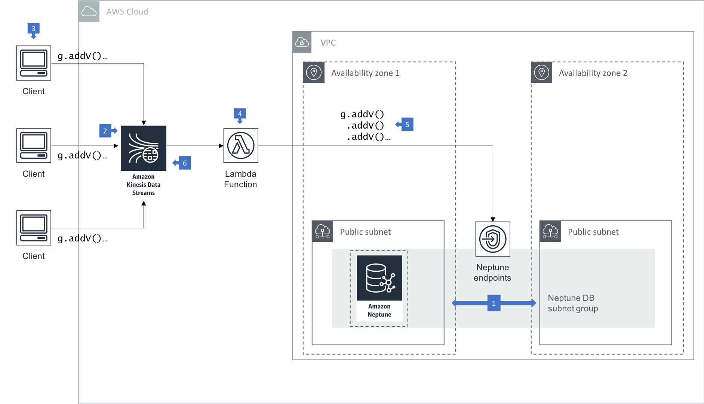

# Writing to Amazon Neptune from an Amazon Kinesis Data Stream

You can improve the reliability, performance and scalability of your application by reducing the coupling between components. If your application is composed of multiple distributed services, you can reduce coupling by introducing queues – message queues, streams, etc. – between components.

When using Amazon Neptune in high write throughput scenarios, you can improve the reliability, performance and scalability of your application by sending logical writes from your client to an Amazon Kinsesis Data Stream. An AWS Lambda function  polls the stream and issues batches of writes to the underlying Neptune database.

### Walkthough of the Architecture

  1. In this architecture your Neptune cluster is run in at least two subnets in two Availability Zones, with each subnet in a different Availability Zone. By distributing your cluster instances across at least two Availability Zones, you help ensure that there are instances available in your DB cluster in the unlikely event of an Availability Zone failure.
  2. A Kinesis Data Stream is provisioned to accept write requests from client applications, which act as record producers.
  3. Clients can use the [Amazon Kinesis Data Streams API](https://docs.aws.amazon.com/streams/latest/dev/developing-producers-with-sdk.html) or [Kinesis Agent](https://docs.aws.amazon.com/streams/latest/dev/writing-with-agents.html) to write individual records to the data stream.
  4. An AWS Lambda function [processes records in the data stream](https://docs.aws.amazon.com/lambda/latest/dg/with-kinesis.html). Create a Lambda function and an event source mapping. The event source mapping tells Lambda to send records from your data stream to the Lambda function, which uses a Gremlin or SPARQL client to submit write requests to the Neptune cluster endpoint.
  5. The Lambda function issues batch writes to Neptune. Each batch is executed in the context of a single transaction. 
  6. To increase the speed at which the function processes records, add shards to the data stream. Lambda processes records in each shard in order, and stops processing additional records in a shard if the function returns an error.

### Best Practices

  * See [Accessing Amazon Neptune from AWS Lambda Functions](../../src/accessing-from-aws-lambda) for details on deploying Lambda functions that write to Amazon Neptune.
  * This architecture is intended for scenarios in which a large number of clients trigger individual writes to the backend, as is often the case with many Web applications or mobile applications. In some circumstances you may want to aggregate write requests before submitting them to the Kinesis Data Stream: an IoT application in which many devices frequently emit small status updates falls into this category, for example. To implement record aggregation in the client, and deaggregation in your Lambda functions, use the [Kinesis Producer Library Deaggregation Modules for AWS Lambda](https://github.com/awslabs/kinesis-aggregation).
  * Consider pulling large batches from the stream (by configuring the batch size property in the [event source mapping](https://docs.aws.amazon.com/lambda/latest/dg/with-kinesis.html#services-kinesis-eventsourcemapping)), but writing smaller batches to Neptune one after another in a single Lambda invocation. For example, pulling 1000 records from the stream, and issuing 10 batch writes, each of 100 records, to Neptune during a single Lambda invocation. This allows you to tune batch write size according to factors such as the instance size of the Neptune database leader node and the complexity of your writes, while reusing a connection for the several batch writes you issue to Neptune during a single Lambda invocation. Be aware, however, that if any of the batch writes to Neptune fails and the failure propogates outside the Lambda function, the entire batch that was pulled from the stream will be retried on the next invocation of the function. 
  * Use idempotent writes to ensure the correct outcome irrespective of the number of times a write is attempted. If you are using Gremlin, you can use the [`coalesce()` step to implement idempotent writes](http://kelvinlawrence.net/book/Gremlin-Graph-Guide.html#coaladdv).
  * You can control concurrency by adjusting the number of shards in your Kinesis Data Stream. For example, two shards will result in two concurrent Lambda invocations, one per shard. If you use shards to control concurrency, we recommend setting the number of shards to no more than 2 x the number of vCPUs on the Neptune leader node.
  * A shard is a throughput unit of Amazon Kinesis Data Streams, and the service is charged on [Shard Hours and PUT Payload Units](https://aws.amazon.com/kinesis/data-streams/pricing/). Increasing the number of shards in order to increase concurrency and throughput will therefore increase costs. 
  * Alternatively, at the expense of additional engineering effort, you can increase concurrency using the threading model particular to your Lambda runtime.
  * Records in a Kinesis Data Stream are ordered per shard based on insert time. However, there is no total ordering of records within a stream with multiple shards. When using this architecture, either ensure that logical writes are wholly independent of one another such that they can be executed out of insert order, or direct dependent writes to the same shard using partition keys to group data by shard. If you are processing batches in a serial fashion within a Lambda function, you can maintain the insert order imposed by the shard with which the function is associated. If, however, you implement your own concurrency inside a Lambda fucntion, writes to Neptune can end up being ordered differently from the order imposed by the shard.
  
### Learn More

  * Download or run an example of [Writing to Amazon Neptune from an Amazon Kinesis Data Stream](https://github.com/aws-samples/amazon-neptune-samples/tree/master/gremlin/stream-2-neptune)